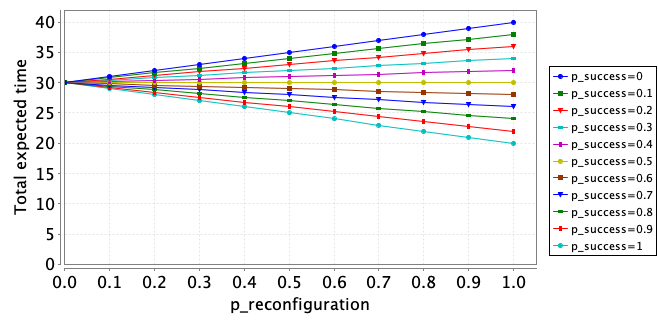
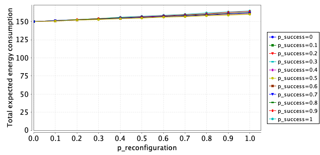

# NFM 2024 Case Study

Model and Properties for the Submitted NFM 2024 Paper

File [UAV_model.prism](UAV_model.prism) contains the sythnesized Markov Decision Process (MDP) model used for the verification and selection of appropriate reconfiguration options with the aim of satisfying the mission requirements.

File [properties.pctl](properties.pctl) contains the multi-objective properties used for policy synthesis. 

Folder [MDP model generation](MDP%20model%20generation) includes the [modelGen.py](MDP%20model%20generation/modelGen.py) script which receives input from the [config.json](MDP%20model%20generation/config.json) file and generates the MDP model according to the defined parameters. 

## Experiments

The following graphs depict changes on the output values of the multi-objective properties for different values of *p_reconfiguration* and *p_success*, with the former referring to the probability of the system needing reconfiguration due to weather conditions and the latter to the probability of successfully reconfiguring the system.

The first graph shows the total expected time for *p_reconfiguration* and *p_success* ranging between [0,1] with step 0.1.

$$\text{multi}(R\{\text{``time"}\}\text{ min=? [ C ], } R\{\text{``energy"}\} \leq 200\text{ [ C ], } R\{\text{``confLvl"}\} \geq 3\text{ [ C ]})$$

As observed in the graph, the policy satisfies the mission requirements for all combinations of values.

As the probability of reconfiguration increases, the total expected time decreases because a faster configuration is being selected. Conversely, for lower probabilities of successful reconfiguration, the total expected time increases because the backup option is being triggered which is not as efficient in terms of time. 

The second graph depicts the total expected energy consumption for *p_reconfiguration* and *p_success* ranging between [0,1] with step 0.1.

$$\text{multi}(R\{\text{``energy"}\}\text{min=? [ C ], } R\{\text{``time"}\} \leq 30\text{ [ C ], } R\{\text{``confLvl"}\} \geq 3\text{ [ C ]})$$

In this case, the policy satisfies the mission requirements only for *p_success* $\geq$ 0.5.

As the probability of reconfiguration increases, the total expected energy consumption increases because while the new configuration is faster, it also consumes more energy. Therefore, the policy does not satisfy the mission requirements in all scenarios. 